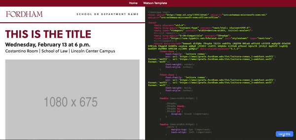

# React Email Builder

An email builder that uses React to bring emails into a modern dev environment. Build component-based emails that are easy to reuse, keep your code clean, avoid bloat, and most importantly hide all of the email client-specific hacks that are unfortunately necessary.

Generate HTML output as you code that can be copied into any email editor. Takes care of CSS inlining, removes unused styles, and removes unneeded classes and IDs.

Uses [Next.js](https://nextjs.org/), [Typescript](https://www.typescriptlang.org/), and [Styled Components](https://www.styled-components.com/).

## Getting Started

These instructions will get you a copy of the project up and running on your local machine. The instructions use [Yarn](https://yarnpkg.com/) but you could easily substitute [NPM](https://npmjs.com/).

### Installing

Install the dependencies

```
yarn
```

Start dev mode

```
yarn dev
```

### Building an Email
Create a new page in the `pages` directory.

Copy the following boilerplate to get started:

```typescript jsx
import React, { Fragment } from "react";
import EmailViewer from "../layouts/EmailViewer";
import { GlobalScaffold } from "../components/Container";

export default () => (
  <EmailViewer>
    <Fragment>
      <GlobalScaffold />
      // Your email content goes here
    </Fragment>
  </EmailViewer>
);

```

Global styles go in `components/GlobalScaffold.tsx`

## Deployment

HTML Output is generated as you build. You can show/hide the generated HTML by toggling the layout button.



## Built With

* [Next.js](https://nextjs.org/) - React framework
* [Typescript](https://maven.apache.org/) - Modern Javascript + Typing = :thumbsup:
* [Styled Components](https://www.styled-components.com/) - CSS in JS
* [Juice](https://github.com/Automattic/juice) - CSS Inliner
* [JS Beautifier](https://github.com/beautify-web/js-beautify) - Because not all email clients like minified HTML
* [Declassify](https://github.com/jrit/declassify) - Remove unneeded classes and IDs.
* [React Syntax Highlighter](https://github.com/conorhastings/react-syntax-highlighter) - Prettify our output HTML using [highlight.js](https://highlightjs.org/)

## Authors

* **Michael Foley** - [michaeldfoley.com](https://michaeldfoley.com)

## License

This project is licensed under the MIT License - see the [LICENSE.md](LICENSE.md) file for details
